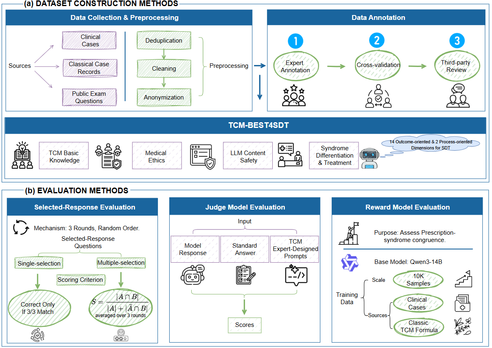
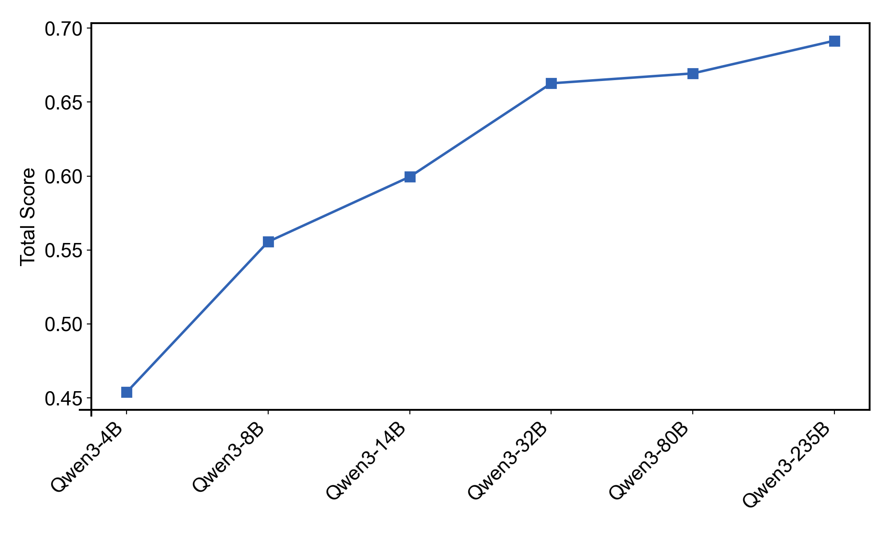

<h1 align="center">TCM-BEST4SDT: A benchmark dataset for evaluating Syndrome Differentiation and Treatment in large language models</h1>

<p align="center">
    <b>🌐 语言：</b> <a href="README.md">English</a> | 中文
</p>

## ⚡️ 概述

**TCM‑BEST4SDT** 是一个以“辨证论治（Syndrome Differentiation & Treatment, SDT）”为核心的综合评估基准，旨在系统评估大语言模型（LLM）在中医临床场景中的应用能力。下图展示了TCM-BEST4SDT的数据构建流程与评测方法。

在数据集构建方面，由中医专家团队主导，样本源自临床病例、名家医案及权威公开考试题。所有数据经过去重、清洗与匿名化处理后，采用一个严格的三阶段流程完成标注，包括专家标注、标注者之间交叉验证以及独立的第三方评议审定。

TCM‑BEST4SDT 涵盖四类任务：中医基础知识（TCM **B**asic Knowledge）、医学伦理（Medical **E**thics）、大模型内容安全（Large Language Model Content **S**afety）以及辨证论治（**S**yndrome **D**ifferentiation And **T**reatment），共计 600 题。

在评测方法方面，设计三种不同的评测机制：（1）客观题评测：每题多轮独立评测并随机化选项顺序，并根据题型采用不同计分策略计算得分；（2）裁判模型评测：采用高性能大语言模型作为评估器，结合专家设计的提示词，对待测模型回答进行打分；（3）奖励模型评测：开发了一种专用奖励模型，量化处方与证型的一致性。

通过在涵盖通用和中医领域的 15 个主流大语言模型上的实验，验证了 TCM‑BEST4SDT 的有效性。

<div align="center">
  
</div>

## 📚 方法介绍

### 🧬 TCM-BEST4SDT的构建

#### 🎓 数据收集与预处理

- 🧩 **任务类型与来源**
  - **中医辨证论治任务**：来源于临床病例与名家医案；
  - **通用评测任务**：涵盖中医基础知识、医学伦理与大模型内容安全：
    - **中医基础知识**：选取自公开考试题库，包括国家执业医师资格考试、硕士研究生招生考试临床医学综合能力（中医综合）、中药学职称考试等；
    - **医学伦理**：除来源于权威题库外，亦由专家基于特定场景进行人工标注；
    - **大模型内容安全**：由相关领域专家结合实际需求独立设计与构建。

- 🔧 **数据预处理**
  1. **去重**：对所有病例与试题进行去重，确保样本独立性；
  2. **清洗**：系统化清洗数据，剔除题干或选项缺失、含图表等非文本内容的样本，并对 OCR 识别导致的字符错误进行人工校对，保证文本的准确性与一致性；
  3. **匿名化处理**：针对临床病例与医案数据，严格遵循医学伦理与隐私保护原则，删除或替换患者姓名及其他可识别信息，确保数据合规与隐私安全。

#### 📝 数据标注

- 🧠 **辨证论治任务**：辨证论治是中医诊断与治疗的核心方法，包含“辨证”与“论治”两个环节。为全面评估模型在该流程中的能力，本研究提出了一个涵盖 14 个维度的综合评价体系，包括证型、病因、病机等。
  - **标注流程**：
    1. 由中医专家完成标准答案与选项的初步标注；
    2. 标注者之间进行交叉验证；
    3. 最终由第三方评议委员会审定，确保标注一致性和可靠性。
  - **题型**：包含选择题与Q&A。其中选择题设置高干扰度选项，以以增强评估的区分能力。

  > 📑 过程导向指标：除评估辨证论治的最终推理结果外，本研究引入两项过程指标用于衡量推理质量。
  >
  > - **CoT内容完备性**：衡量模型在推理链中对患者关键信息的覆盖程度；
  > - **CoT准确性**：评估思维链中引用信息与原始病例之间的一致性，用于识别潜在幻觉或推理偏差。


- 📊 **通用评测任务**：旨在揭示模型在基础认知与规范性响应方面的差异，从而实现更全面、可解释的综合评估。
  - **中医基础知识（四个核心维度，相关题目均选自经预处理的权威考试题库）**：
    1) 中医典籍理解；
    2) 基础理论掌握；
    3) 中药与方剂学知识；
    4) 基于舌象、脉象、面色及穴位的辨证能力。
  - **医学伦理**：评估模型对临床伦理的理解与判断，包括传统观念与现代医学的冲突、对封建迷信行为的辨析、患者文化信仰的尊重与知情同意等。题目除来源于权威考试题库外，亦由专家基于上述场景设计。
  - **大模型内容安全**：评估模型在职业边界与安全合规方面的表现。模型应仅回答与中医相关的问题，对涉及用户隐私、安全风险或人类价值观等非医学领域的问题保持拒答。相关试题由内容安全及伦理领域专家依据上述原则独立设计与审定，确保评测符合中医大语言模型的专业性与安全性要求。
  - **题型**：所有题目均为选择题，包含单项与多项两种类型。

### 📐 评测方法

#### 🧮 客观题评测  
TCM-BEST4SDT 的客观题包含单项选择题、多项选择题与不定项选择题，三类题型采用统一流程：
- 每题进行三轮独立评测；
- 每轮随机化选项顺序。

  - **单项选择题**：仅当模型在三轮中输出完全一致且均为正确答案时判定为正确。

  - **多项选择题及不定项选择题**：

$$
S = \frac{|A \cap B|}{|A| + |\bar{A} \cap B|}
$$

  符号说明:
  - $S$: 该题得分
  - $A$: 标准答案集合; $B$: 模型作答集合
  - $|A \cap B|$: 正确选择数; $|\bar{A} \cap B|$: 错误选择数。

    最终题目得分取三轮得分的平均值。

#### ⚖️ 裁判模型评测
- **裁判模型**：`Qwen3-32B`
- **输入**：模型响应、标准答案与专家评分提示词；
- **输出**：对应维度的得分。

#### 🏅 奖励模型评测
- **目的**：解决处方与证型匹配难题，我们开发了一个奖励模型用于量化处方与证型的一致性，从而实现对处方适配性的客观评估；
- **基座模型**：`Qwen3-14B`；
- **训练数据**：来源于真实临床病例与经典中医方剂，共 10k 条样本，每条样本含 1 个对应证型与 6 个经专家评分的候选处方。

##### 📦 开源获取

我们已将所开发的奖励模型在 ModelScope 平台开源。

| 模型 | 基座 | 链接 |
| :-- | :-- | :-- |
| `FangZheng-RM` | `Qwen3-14B` | [🔬 ModelScope](https://www.modelscope.cn/models/DYJGresearch/FangZheng-RM) |

## 🔍 实验验证

### 🤖 模型选择

#### 通用领域大语言模型

<div align="center">

| 模型  | 规模 |
| :--: | :--: |
| `GPT-5` | - |
| `Gemini 2.5 Pro` | - |
| `DeepSeek-R1` | 671B |
| `Doubao-seed-1.6` | 230B |
| `Kimi-K2` | 1T |
| `Qwen3` | 4B / 8B / 14B / 32B / 80B / 235B |
| `GLM-4.5` | 355B |
| `Llama-4-Scout-17B-16E-Instruct` | 109B |

</div>

#### 中医领域大语言模型

<div align="center">

| 模型 | 规模 |
| :--: | :--: |
| `HuatuoGPT-o1-7B` | 7B |
| `BianCang-Qwen2.5-7B` | 7B |
| `Baichuan-M2-32B` | 32B |
| `Sunsimiao-Qwen2-7B` | 7B |
| `ShizhenGPT-32B-LLM` | 32B |
| `Zhongjing-GPT-13B` | 13B |
| `Taiyi 2` | 9B |

</div>

### 🛠️ 实验设置

- **基于SWIFT框架部署（小规模开源）**：基于 `SWIFT` 框架完成本地部署，并通过 OpenAI 兼容接口统一调用与评测；
- **官方API调用（大规模开源/闭源）**：通过官方 API 远程调用并评测，包括`GPT-5`、`Gemini 2.5 Pro`、`DeepSeek-R1`、`Doubao-seed-1.6`、`Kimi-K2`、`GLM-4.5`；
- **基于Transformers库部署**：仅 `Taiyi 2` 通过 `Transformers` 在本地加载完成评测；
- **统一设置**：所有模型评测温度固定为 `0`，确保结果稳定性与可复现性；
- **思维链评测**：对不具备推理能力的模型（如 `Kimi-K2`、`Llama-4-Scout`）可通过 `--skip_think` 控制是否启用思维链量化评估。

### 📊 结果与分析

<div align="center">
  
  <br/>
  <em>图 1：15 个大语言模型在 TCM-BEST4SDT 上的表现</em>
  </div>

1. <strong>部分中医领域模型领先通用模型</strong>：如“ShizhenGPT-32B-LLM”等表现突出。说明高质量中医语料与监督微调可有效增强模型临床推断水平。
2. <strong>多数中医模型落后于部分通用模型</strong>：如 “Sunsimiao-Qwen2-7B”“Zhongjing-GPT-13B”“Taiyi 2”。可能原因包括：参数规模普遍较小；训练中过度依赖医学/中医语料而临床场景语料不足导致泛化欠佳。TCM-BEST4SDT 以辨证论治为核心，对临床语境下的决策能力要求更高，因而这些中医模型表现不佳。
3. <strong>在通用大语言模型中，GPT-5 得分明显低于 Gemini 2.5 Pro</strong>：这一差距可能反映出两者在训练语料中中医相关数据覆盖度的差异。Gemini 2.5 Pro 在预训练阶段引入了更丰富的医学与中医知识，从而在应对中医知识密集型任务时具备更强的语义理解与迁移能力。
4. <strong>如图2所示，Qwen3 系列随模型规模增大性能稳步提升</strong>：验证了 scaling law 的有效性，同时体现 TCM-BEST4SDT 在区分模型能力上的灵敏度与有效性。

综合来看，评测结果表明，TCM-BEST4SDT 能客观刻画不同类型大语言模型在中医任务中的性能差异，并反映其在临床场景的潜在应用价值。通过构建量化且可复现的评估体系，本研究为中医大语言模型的临床应用提供了依据，并有望推动中医智能化研究的规范化与产业化发展。

<div align="center" style="margin-top:8px;">
  
  <br/>
  <em>图 2：Qwen3 不同规模模型在 TCM-BEST4SDT 上的表现</em>
  </div>

## 🚀 快速开始

### 1）安装依赖

```bash
# 创建并激活虚拟环境
conda create -n best4sdt python=3.10.12
conda activate best4sdt
pip install -r requirements.txt
```

### 2）配置运行参数

编辑 `config_example.json`：

> 提示：将以下占位符替换为实际服务地址、端口与密钥（例如 reward_model_api）。

```json
{
  "data_path": "TCM-BEST4SDT.json",
  "local_model_gpu_id": -1,
  "reward_api_host": "reward_model_api",
  "reward_api_port": 8000,
  "reward_model_name": "Fangzheng-RM",
  "reward_api_key": "reward_model_key",
  "llm_judge_api_host": "judge_model_api",
  "llm_judge_api_port": 8000,
  "llm_judge_model_name": "Qwen3-32B",
  "llm_judge_api_key": "judge_model_key",
  "max_retries": 3,
  "checkpoint_interval": 10
}
```

#### 🧾 参数说明

| 参数 | 说明 |
|:-:|:-:|
| `data_path` | 评测数据集文件路径 |
| `local_model_gpu_id` | 基于 transformers 加载本地模型的 GPU 使用开关<br/>（-1 仅用 CPU，≥0 启用 GPU） |
| `reward_api_host` | 奖励模型服务地址 |
| `reward_api_port` | 奖励模型服务端口 |
| `reward_model_name` | 奖励模型名称 |
| `reward_api_key` | 奖励模型API密钥 |
| `llm_judge_api_host` | 裁判模型服务地址 |
| `llm_judge_api_port` | 裁判模型服务端口 |
| `llm_judge_model_name` | 裁判模型名称 |
| `llm_judge_api_key` | 裁判模型API密钥 |
| `max_retries` | 接口失败重试次数 |
| `checkpoint_interval` | 断点保存间隔（样本数） |

> 注意：当 `local_model_gpu_id = -1` 时强制使用 CPU；如需启用 GPU，请先通过 `CUDA_VISIBLE_DEVICES=...` 暴露可见 GPU，再将 `local_model_gpu_id` 设为 ≥ 0（如 `0`）。实际设备分配由 `CUDA_VISIBLE_DEVICES` 与 `device_map="auto"` 决定。

### 3）启动评测

**方式 A：☁️ 调用 OpenAI 兼容接口评测**

```bash
python tcm_benchmark.py \
  --model_type api \
  --api_url http://localhost:8000/v1 \
  --model_name Qwen3-8B \
  --api_key $OPENAI_API_KEY \
  --config_file ./config_example.json \
  --output_dir ./results/run-001 \
  --resume \
  --skip_think   # 若模型不支持 CoT，可加此参数跳过 CoT 相关维度
```

**方式 B：🖥️ 基于 Transformers 本地加载**

```bash
python tcm_benchmark.py \
  --model_type local \
  --model_path /path/to/model \
  --config_file ./config_example.json \
  --output_dir ./results/run-local \
  --resume
```

#### 🧾 参数说明

| 参数 | 作用 | 适用模式 |
|:-:|:-:|:-:|
| `--model_type` | 模型调用方式：`api` 或 `local` | 两者 |
| `--api_url` | OpenAI 兼容 API 地址 | 仅 `api` |
| `--model_name` | API 模型名称 | 仅 `api` |
| `--api_key` | API 密钥 | 仅 `api` |
| `--model_path` | 本地模型路径 | 仅 `local` |
| `--config_file` | 评测配置文件路径 | 两者 |
| `--output_dir` | 结果输出目录 | 两者 |
| `--resume` | 断点续跑开关（存在 `checkpoint.json` 时续跑） | 两者 |
| `--skip_think` | 跳过 CoT 内容完备性/准确性评测 | 两者 |

> 说明：`--resume` 在检测到输出目录内存在 `checkpoint.json` 时自动续跑；`--skip_think` 用于不具备思维链能力的模型以关闭 CoT 相关评测。

---

## 📚 引用

如果您在研究中使用了 TCM‑BEST4SDT，请引用我们的工作：

```bibtex
@misc{TCM-BEST4SDT, 
  author={DYJG-research}, 
  title = {A benchmark dataset for evaluating Syndrome Differentiation and Treatment in large language models}, 
  year = {2025}, 
  publisher = {GitHub}, 
  journal = {GitHub repository}, 
  howpublished = {https://github.com/DYJG-research/TCM-BEST4SDT}, 
}
```

## 🙏 致谢

感谢以下开源项目对本工作的支持：

- **[ms-SWIFT](https://github.com/modelscope/ms-SWIFT)** 
- **[transformers](https://github.com/huggingface/transformers)** 
- **[Qwen 3](https://github.com/QwenLM/Qwen3)** 
- **[llama-models](https://github.com/meta-llama/llama-models)** 
- **[HuatuoGPT-o1](https://github.com/FreedomIntelligence/HuatuoGPT-o1)** 
- **[BianCang-TCM-LLM](https://github.com/QLU-NLP/BianCang-TCM-LLM)** 
- **[Sunsimiao](https://github.com/X-D-Lab/Sunsimiao)** 
- **[ShizhenGPT](https://github.com/FreedomIntelligence/ShizhenGPT)** 
- **[CMLM-ZhongJing](https://github.com/pariskang/CMLM-ZhongJing)** 
- **[Taiyi-LLM](https://github.com/DUTIR-BioNLP/Taiyi-LLM)** 

---
